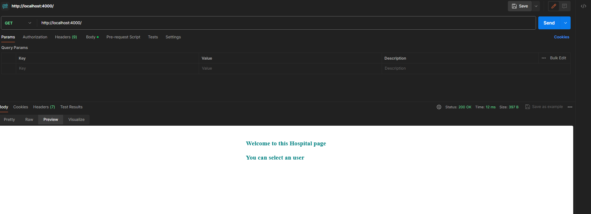

You can explore more pictures in the [Pictures](./Pictures) directory.

Author: [KitsuneKode](https://github.com/KitsuneKode)

# Express Kidney Hospital API

This project is an Express.js API that simulates a kidney hospital. It allows users to perform various operations related to kidney health, such as checking the number of kidneys they have, adding a new kidney, replacing a kidney, and removing a kidney. This problem statement project is part of Week 2 of the 0-100xDev course.

## Getting Started

To get started with this project, follow these steps:

1. Clone the repository to your local machine.
2. Install the required dependencies by running `npm install` in the project directory.
3. Start the server by running `node index.js` or `npm start` in the project directory.
4. The server will start running on `http://localhost:4000`.

## API Endpoints

The following API endpoints are available:

### 1. GET /

This endpoint allows users to check the number of kidneys they have and their health status.

#### Query Parameters

- `name` (required): The name of the user to check.

### 2. POST /

This endpoint allows users to add a new kidney.

#### Request Body

- `addStatus` (required): The status of the kidney to add. Valid values are "Healthy" or "Not Healthy".

### 3. PUT /

This endpoint allows users to replace all "Not Healthy" kidneys with "Healthy" kidneys.

### 4. DELETE /

This endpoint allows users to remove all "Not Healthy" kidneys.

## Data Structure

The data structure used in this project is an array of user objects. Each user object has a `name` property and a `kidneys` property, which is an array of kidney objects. Each kidney object has a `status` property, which represents the health status of the kidney.

## Usage Examples

Here are some examples of how to use the API endpoints:

### GET /

- Request: `GET /?name=John`
- Response: `Welcome to this Hospital page John. Number of Kidneys: 2. Number of Good Kidneys: 1. Number of Bad Kidneys: 1. Status of Kidneys: Not Healthy.`

### POST /

- Request: `POST /`
- Request Body: `{ "addStatus": "Healthy" }`
- Response: `{ "Updated_Stats": "Kidney_Added" }`

### PUT /

- Request: `PUT /`
- Response: `All the Bad kidneys are replaced with good ones.`

### DELETE /

- Request: `DELETE /`
- Response: `The patient's Kidneys are healthy.`

## Contributing

Contributions to this project are welcome. If you find any issues or have any suggestions for improvement, please open an issue or submit a pull request.
For more details, please refer to the [contribution.md](contribution.md) file.

## License

This project is licensed under the [MIT License](LICENSE).

## Contact

If you have any questions or need further assistance, please feel free to contact the project maintainer at .

## Acknowledgments

Thanks to all contributors and their valuable input.

## Future Improvements

This is a basic application and there are many potential improvements, such as adding a persistent database, validating input, and handling errors more gracefully.
